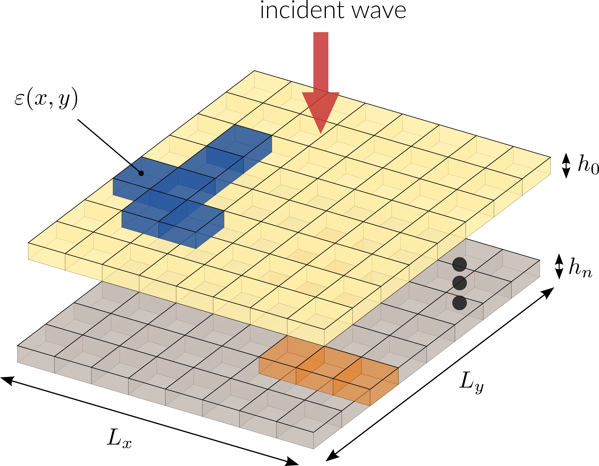

=============
Documentation
=============

.. only:: html

  .. raw:: html

    

  .. include:: ../README.rst
    :end-before: inclusion-marker-badges

  .. raw:: html

    

Welcome! This is the documentation for ``nannos`` v |release|, last updated on |today|.

``nannos`` is a `Python <http://python.org/>`_ package that solves Maxwell's equations 
in bi-periodic multilayer stacks using the Fourier Modal Method (FMM).

The code of the project is `on Gitlab <https://gitlab.com/nannos/nannos>`_

Features
========

* Computation of transmitted and reflected efficiencies for the 
  various diffraction orders.
* Calculation of the electromagnetic field in the structure.
* Various FMM formulations.
* Automatic differentiation enabling inverse design of metasurfaces.
* GPU acceleration.

.. toctree::
   :maxdepth: 2
   :hidden:

   installation
   api
   biblio
   license
